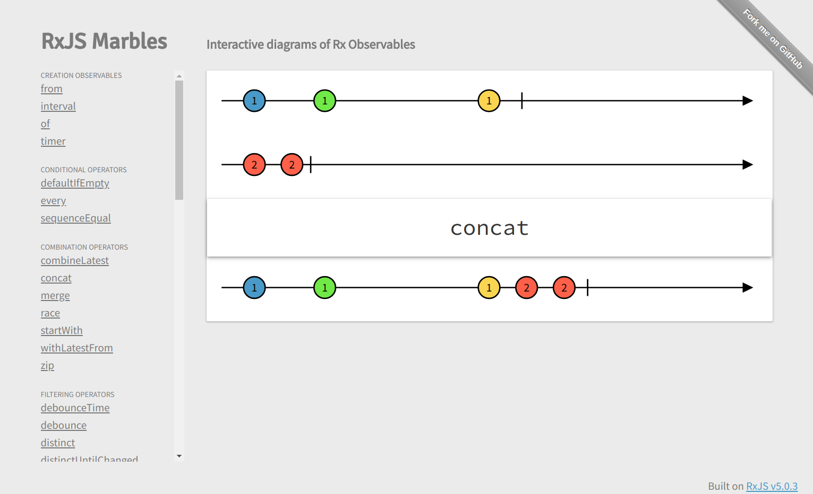

# Promises

vs

# observables

+++

# modeling delay

vs

# modeling time

---

# Promise

```js
try {
  let value = doStuff();

  /* .. use the value .. */
} catch (e) {
  /* .. clean up .. */
}
```

```js
let promise = doStuff();

promise.then((value) => {
  /* .. use the value .. */
}).catch((e) => {
  /* .. clean up .. */
}
```

+++

# Promises over time

|        | `--^`  | `-----^` |
|--------|--------|----------|
| `---B` | `---B` | `-----B` |
| `---#` | `---#` | `-----#` |

`-` time • `^` then • `B` message • `#` error

+++

# Operators

|        | promise.race() | promise.all() |
|--------|--------|----------|
| `-A` <br /> `--B` <br /> `---C` | <br />  `-A` | <br />  `---(ABC)`  |

`-` time • `A` message • `()` synced events

---

# Observables

```js
rx.Observable.of(1, 2, 3);
// (1,2,3)|

rx.Observable.interval(1000);
// 0---1---2---3---4--

rx.Observable.fromEvent(element, 'click');
// ---e--e-------e----
```

`-` time • `e` event • `()` synced events • `|` complete


+++

# Transformation operators

```js
source = ..
// 0-1-2-3-4|

source.map(x => x * 2)
// 0-2-4-6-8|

source.bufferTime(1000);
// ----0-1-2-3-4|

source.scan((x, y) => x + y);
// 0-1-3-6-10|
```

& `concatMap`, `mergeMap`, `switchMap` - in total 23

+++

# Filter operators

```js
source = ..
// 0-1-2-3-4|

source.filter(x => x > 2)
// ------3-4|

source.take(3);
// 0-1-2|

```

& `debouceTime`, `distinctUntilChanged`, `takeUntil` - in total 17

+++

# Repeat & retry

```js
source1 = ..
// 0--1--2--3--4|

source2.repeat(2)
// 0--1--2--3--40--1--2--3--4|

source2 = ..
// 0---1---2---3#

source2.retry(2)
// 0---1---2---30---1---2---30---1---2---3#
```

+++

# Combination op.

```js
source1 = ..
// 0--1--2--3--4|
source2 = ..
// 0---1---2---3|

source1.merge(source2)
//(00)11-2-23--(34)|

source1.concat(source2)
// 0--1--2--3--40---1---2---3|
```

& `combineLatest`, `startWith`, `withLatestFrom` - in total 12

---

# Cold observables - unicast

```js
timer$ = rx.Observable.interval(1000);

timer$.subscribe((x) => console.log(x)); // clock 1

/* .. wait 5s ..  */
timer$.subscribe((x) => console.log(x)); // clock 2

/* .. wait 5s ..  */
timer$.subscribe((x) => console.log(x)); // clock 3
```

+++

# Hot observables - multicast

```js
click$ = Rx.Observable.fromEvent(document, 'click')

click$.subscribe((x) => console.log(x)); // gets all clicks

/* .. wait 5s ..  */
click$.subscribe((x) => console.log(x)); // get clicks from 5s

/* .. wait 5s ..  */
click$.subscribe((x) => console.log(x)); // get clicks from 10s
```

+++

# Cold => hot

```js
timer$ = rx.Observable.interval(1000);

sharedTimer$ timer$.

sharedTimer$.subscribe((x) => console.log(x)); // clock 1

/* .. wait 5s ..  */
sharedTimer$.subscribe((x) => console.log(x));
  // clock 1, delayed subscription
```

---

# Testing

```js
scheduler = rx.TestScheduler();
scheduler.assertDeepEqual = function(actual, expected) { /* .. */ }

mock$ = rx.scheduler.createColdObservable('--a--a--a');

test$ = method(mock$);

scheduler.expectObservable(test$).toBe('--b--b--b');
scheduler.expectSubscriptions(mock$).toBe(['^']);

// RUN! nothing checked before this point
scheduler.flush();

// no checks meaningfull here
```

+++

# Resources

---

# [rxmarbles.com](http://rxmarbles.com)


---

# [www.learnrxjs.io](https://www.learnrxjs.io)


+++

# Summary

* powerful tool for dealing with data that changes over time
* one or two orders of magnitude more complicated then promises
* worth it
